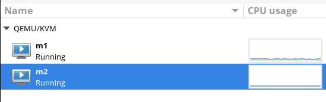

## Задача
"Создать Docker Compose скрипт для развертки кластера из трех инстансов cassandra, причем каждый из них должен быть доступен из основной (локальной) сети по отдельному ip адресу."
### Стек
Для решения поставленной задачи использовались:\
Виртуализация: qemu-kvm libvirt virt-install virt-manager cloud-utils \
Работа с контейнерами: docker-ce docker-ce-cli containerd.io docker-buildx-plugin docker-compose-plugin

## Сеть 192.168.1.1
Изначальная задача состоит в создании сети, в которой можно развернуть виртуальные машины и контейнеры. Тут возникает проблема, что хост подключается по wi-fi а не по проводу, так что создать bridge не получилось...\
Решено было создать виртуальную подсеть и перенаправить трафик через таблицу маршрутизации роутера. После этого развернуть в данной сети виртуальные машины и контейнеры.

### Cоздание сети через libvirt на хост машине (fedora).
Для инициализации сети можно использовать XML конфигурацию или настроить сеть в GUI VMM.  Так как нам интересны адреса 192.168.1.197-192.168.1.202 - занимаются адреса с маской 255.255.255.0 (/24). \
__Пример используемой конфигурации:__
``` XML
<network>
  <name>rn0</name>
  <uuid>8ab68806-0c58-46c7-bb8a-e457a8eeed69</uuid>
  <forward mode="route"/>
  <bridge name="virbr1" stp="on" delay="0"/>
  <domain name="rn0"/>
  <ip address="192.168.1.1" netmask="255.255.255.0">
    <dhcp>
      <range start="192.168.1.128" end="192.168.1.254"/>
    </dhcp>
  </ip>
</network>
```
Создание сети с помощью описанной конфигурации:
``` bash
sudo virsh net-define virbr1.xml
sudo virsh net-start virbr1
sudo virsh net-autostart virbr1
```

Также чтобы устройства в локальной сети могли получить доступ, требуется создать маршрут на роутере:


## Создание виртуальных машин
Создание образа m1 и m2 (A, B) на базе Ubuntu 22.04 LTS server. \
Используется VMM. Создать машины можно через GUI или командой:

``` bash
sudo virt-install --name m1 --ram 4096 --vcpus 2 \
  --disk path=/var/lib/libvirt/images/m1.qcow2, format=qcow2 \
  --disk path=./ubuntu.iso, device=cdrom \
  --os-variant ubuntu22.04 --network network=routed-net --import --noautoconsole
```



Первичный запуск производился в ручном режиме (созданы пользователи и сервера ssh). \
Для m1(vm1 - A) следует выделить больше ОЗУ, иначе могут возникнуть проблемы при запуске трех узлов с cassandra.

## Переопределение ip машин
После инициализации машины получают случайные адреса от dhcp. Чтобы занять определенные адреса создается файл конфигурации netplan (менеджер на ubuntu).\
__Пример файла на первой машине__:
``` yaml
m1@m1:/etc/netplan$ cat 01-netcfg.yaml 
network:
  version: 2
  renderer: networkd
  ethernets:
    enp1s0:
      dhcp4: no
      addresses:
        - 192.168.1.197/24
      routes:
      - to: default
        via: 192.168.1.1
      nameservers:
        addresses: [1.1.1.1, 8.8.8.8]
```
На второй машине меняется адрес на 192.168.1.198/24. \
Безопасное применение новой конфигурации:
```
sudo netplan try 
```
После этого машины имеют адреса 192.168.1.197 (vm1 - A) и 192.168.1.198 (vm2 - B).
## Создание подсети docker
Создание сети docker, где каждый контейнер имеет уникальный интерфейс с MAC адресом. Достигается это за счет подключения подсети к оригинальной сети, которая создана на хосте:
```
docker network create -d macvlan \
  --subnet=192.168.1.0/24 \
  --gateway=192.168.1.1 \
  -o parent=enp1s0 \
  vnet
```
Теперь контейнеры, которые подключены к данной сети, доступны в виртуальной сети 192.168.1.0/24 и в локальной сети. 
## Работа с Dockerfile
Для того чтобы создать группу контейнеров подключенных к сети, используется docker compose. Конфигурацию можно найти в файле: compose.yaml. В данной конфигурации определяем image, который будет использоваться для контейнеров и их адреса в сети (192.168.1.200 - 192.168.1.202).\
Чтобы обеспечить доступ к ssh в контейнере в образе cassandra производится модификация. Файл Dockerfile определяет образ, где создается тестовый пользователь и производится установка ssh сервера и запускается скрипт инициализации (entry.sh), который запускает ssh сервер и передает управление оригинальному скрипту cassandra.\
Перед тем как запустить docker compose up, следует собрать контейнер с подходящим тегом:
```bash
docker build -t cassandra-ssh:test . 
```
## Результаты
В результате - имеем виртуальную подсесть (virtual network switch of [libvirt net](https://wiki.libvirt.org/VirtualNetworking.html#:~:text=of%20common%20scenarios-,Routed%20mode%20example,-%C2%B6)), определенную как 192.168.1.0/24, которую может использовать любое устройство в локальной сети роутера.
#### Коммуникация между машинами A и B:
\
_к машине один удается подключиться из второй машины_.

\
_ssh к контейнеру_.

\
_использование cqlsh_.

#### Подключение из локальной сети:
<div align="center">
  
  
</div>

_подключение от внешнего устройства на андроид по ssh к виртуальной машине и к контейнеру_.